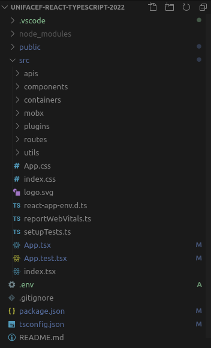

# Criando o projeto

## Montando Ambiente

Vamos fazer o download do NodeJS <https://nodejs.org/en/> de preferência a versão LTS.  (LTS é a versão estável).

Para desenvolver nossos códigos, iremos utiizar o editor Visual Studio Code <https://code.visualstudio.com/>
Ele é leve, possui um depurador integrado, extensões...

Também iremos conhecer o NVM (Node Version Mananger), muito útil para quem necessita ter diversas versões do NodeJS instaladas na máquina.

Linux/Mac: <https://github.com/creationix/nvm>

Windows: <https://github.com/coreybutler/nvm-windows>

---

> Lembre-se que irémos usar como convenção sempre o padrão de nomeclatura de arquivos e pastas `kebab-case`

Projeto Final disponível em: <https://github.com/juninmd/unifacef-react-typescript-2022>

## Create React App

Vamos iniciar utilizando o comando

```bash
npx create-react-app unifacef-react-typescript --template typescript
```

Abra a pasta

```bash
cd unifacef-react-typescript
```

Para abrir o vs code direto

```bash
code .
```

## CSS

Vamos utilizar nesse projeto como framework CSS o Semantic UI

<https://react.semantic-ui.com/>

Seus componentes são bem customizáveis

---

## Codificando

Adcionar Título da página

No arquivo

```text
./public/index.html
```

Vamos alterar o atributo do título para

```tsx
 <title>Unifacef React App</title>
```

Aproveite e adicione a linha do css

```html
<link rel="stylesheet" href="https://cdnjs.cloudflare.com/ajax/libs/semantic-ui/2.4.1/semantic.min.css" />
```

---

Abra o arquivo

```text
./src/app.tsx
```

E modifiquem o conteúdo em texto e deixem a página recarregar.

---

## Dependências do projeto

Vamos agora adicionar novas dependencias aos projeto

```bash
npm install react@16.8.0 react-dom@16.8.0 axios history@4.10.1 jsonwebtoken semantic-ui-css semantic-ui-react sweetalert2 @sentry/browser lodash mobx-react@6.2.2 mobx@5.0.0 mobx-react-router react-router-dom@5.3.0 sweetalert2 @types/react-router-dom@5.3.3 @types/history@4.7.6 @types/lodash @types/node
```

Ajustar dependencias no `package.json`, separar o que é dependência de desenvolvimento e de projeto.

Seu package.json deve ficar assim:

```json
{
  "name": "unifacef-react-typescript",
  "version": "0.1.0",
  "private": true,
  "dependencies": {
    "@sentry/browser": "^6.19.2",
    "@testing-library/jest-dom": "^5.16.3",
    "@testing-library/react": "^12.1.4",
    "@testing-library/user-event": "^13.5.0",
    "@types/history": "^4.7.6",
    "@types/jest": "^27.4.1",
    "@types/lodash": "^4.14.180",
    "@types/node": "^17.0.23",
    "@types/react": "^17.0.43",
    "@types/react-dom": "^17.0.14",
    "@types/react-router-dom": "^5.3.3",
    "axios": "^0.26.1",
    "history": "^4.10.1",
    "jsonwebtoken": "^8.5.1",
    "lodash": "^4.17.21",
    "mobx": "^5.0.0",
    "mobx-react": "^6.2.2",
    "mobx-react-router": "^4.1.0",
    "react": "^16.8.0",
    "react-dom": "^16.8.0",
    "react-router-dom": "^5.3.0",
    "react-scripts": "5.0.0",
    "semantic-ui-css": "^2.4.1",
    "semantic-ui-react": "^2.1.2",
    "sweetalert2": "^11.4.7",
    "typescript": "^4.6.3",
    "web-vitals": "^2.1.4"
  },
  "scripts": {
    "start": "react-scripts start",
    "build": "react-scripts build",
    "test": "react-scripts test",
    "eject": "react-scripts eject"
  },
  "eslintConfig": {
    "extends": [
      "react-app",
      "react-app/jest"
    ]
  },
  "browserslist": {
    "production": [
      ">0.2%",
      "not dead",
      "not op_mini all"
    ],
    "development": [
      "last 1 chrome version",
      "last 1 firefox version",
      "last 1 safari version"
    ]
  }
}
```

Vamos separar as dependências do projeto das que são de dev das quais não são.

```json
{
  "name": "unifacef-react-typescript",
  "version": "0.1.0",
  "private": true,
  "dependencies": {
    "@sentry/browser": "^6.19.2",
    "axios": "^0.26.1",
    "history": "^4.10.1",
    "jsonwebtoken": "^8.5.1",
    "lodash": "^4.17.21",
    "mobx": "^5.0.0",
    "mobx-react": "^6.2.2",
    "mobx-react-router": "^4.1.0",
    "react": "^16.8.0",
    "react-dom": "^16.8.0",
    "react-router-dom": "^5.3.0",
    "react-scripts": "5.0.0",
    "semantic-ui-css": "^2.4.1",
    "semantic-ui-react": "^2.1.2",
    "sweetalert2": "^11.4.7",
    "typescript": "^4.6.3",
    "web-vitals": "^2.1.4"
  },
  "devDependencies": {
    "@testing-library/jest-dom": "^5.16.3",
    "@testing-library/react": "^12.1.4",
    "@testing-library/user-event": "^13.5.0",
    "@types/history": "^4.7.6",
    "@types/jest": "^27.4.1",
    "@types/lodash": "^4.14.180",
    "@types/node": "^17.0.23",
    "@types/react": "^17.0.43",
    "@types/react-dom": "^17.0.14",
    "@types/react-router-dom": "^5.3.3"
  },
  "scripts": {
    "start": "react-scripts start",
    "build": "react-scripts build",
    "test": "react-scripts test",
    "eject": "react-scripts eject"
  },
  "eslintConfig": {
    "extends": [
      "react-app",
      "react-app/jest"
    ]
  },
  "browserslist": {
    "production": [
      ">0.2%",
      "not dead",
      "not op_mini all"
    ],
    "development": [
      "last 1 chrome version",
      "last 1 firefox version",
      "last 1 safari version"
    ]
  }
}
```

---

## Configurando TypeScript

Vamos configurar o arquivo

```text
./tsconfig.json
```

```json
{
  "compilerOptions": {
    "target": "es5",
    "moduleResolution": "node",
    "experimentalDecorators": true,
    "emitDecoratorMetadata": true,
    "preserveConstEnums": true,
    "pretty": true,
    "lib": [
      "dom",
      "dom.iterable",
      "esnext"
    ],
    "module": "esnext",
    "forceConsistentCasingInFileNames": true,
    "allowJs": true,
    "checkJs": true,
    "outDir": "./dist",
    "sourceMap": true,
    "strict": true,
    "typeRoots": [
      "./node_modules/@types"
    ],
    "skipLibCheck": true,
    "jsx": "react",
    "rootDir": "src",
    "noImplicitReturns": true,
    "noImplicitThis": true,
    "noImplicitAny": false,
    "strictNullChecks": true,
    "suppressImplicitAnyIndexErrors": true,
    "noUnusedLocals": true,
    "esModuleInterop": true,
    "allowSyntheticDefaultImports": true,
    "resolveJsonModule": true,
    "isolatedModules": true,
    "noEmit": true
  },
  "include": [
    "src"
  ]
}
```

Vamos remover as variáveis não utilizadas

como no arquivo

```text
./src/App.test.tsx
```

e

```text
./src/App.tsx
```

```jsx
import React from 'react';
```

---
Altere o arquivo

```text
./src/App.tsx
```

Vamos adicionar um botão para mostrar mensagem

```tsx
import './App.css';

import logo from './logo.svg';

function App() {

  const showMessage = () => {
    alert('Teste');
  }

  return (
    <div className="App">
      <header className="App-header">
        
        <p>
          Vamos aprender React
        </p>
        <button onClick={showMessage}>Break the world</button>
        <a
          className="App-link"
          href="https://reactjs.org"
          target="_blank"
          rel="noopener noreferrer"
        >
          React é legal
        </a>
      </header>
    </div>
  );
}

export default App;
```

Clique no botão `Break the world` e verá um alerta na tela.

---

## Estruturando nosso projeto

Vamos criar a seguinte árvore de pastas no projeto:



Crie o arquivo `router.store.tsx`
dentro de mobx

```text
./src/mobx/router.store.tsx
```

```tsx
import { RouterStore } from "mobx-react-router";
import { action } from "mobx";

export default class NewRouterStore extends RouterStore {

  @action setHistory = (path: string) => {
    this.history.push(path);
  }
}

const router = new NewRouterStore();
export { router };
```

Vamos criar nosso arquivo de endpoints da nossa aplicação. No começo ele irá estar vazio mesmo.

```text
./src/routes/endpoints.ts
```

```ts
import { RouteProps } from 'react-router-dom';

interface EndPointsProps extends RouteProps {
  name?: string
}

export const endpoints: EndPointsProps[] = [];
```

---

Crie um componente dentro de components, apartir de uma pasta chamada
main-menu, adicione index.tsx

```text
./src/components/main-menu/index.tsx
```

```tsx
import * as React from "react";

import { inject, observer } from "mobx-react";

import { Menu } from "semantic-ui-react";
import NewRouterStore from "../../mobx/router.store";
import { endpoints } from "../../routes/endpoints";

interface Props {
  router?: NewRouterStore;
}

@inject('router')
@observer
export default class MainMenu extends React.Component<Props> {

  handleItemClick = (_, { url }: any) => {
    const { setHistory } = this.props.router!;
    return setHistory(url);
  }

  render() {
    return (
      <>
        <div className='nav'>
          <Menu color='blue' inverted={true} size='large' secondary={true} stackable={true}>
            {endpoints.filter(x => x.name).map((item, index) => {
              return <Menu.Item
                key={index}
                name={item.path?.toString()}
                url={item.path!}
                onClick={this.handleItemClick}>
                {item.name}
              </Menu.Item>
            })}
          </Menu>
        </div>
      </>
    )
  }
}
```

Vamos agora apagar alguns arquivos:

```text
./src/App.css
./src/App.tsx
./src/App.test.tsx
./src/reportWebVitals.ts
```

Agora vamos alterar o

```text
./src/index.tsx
```

```tsx
import * as React from 'react';
import * as ReactDOM from 'react-dom';
import * as store from './mobx';
import Routes from './routes';
import { createBrowserHistory } from 'history';
import { Provider } from 'mobx-react';
import { router } from './mobx/';
import { Router } from 'react-router-dom';
import { syncHistoryWithStore } from 'mobx-react-router';
import 'semantic-ui-css/semantic.min.css';

const rootElement = document.getElementById('root');
const browserHistory = createBrowserHistory();

const history = syncHistoryWithStore(browserHistory, router);

ReactDOM.render(
  <React.StrictMode>
    <Provider {...store}>
      <Router history={history}>
        <Routes />
      </Router>
    </Provider>
  </React.StrictMode>,
  rootElement
);
```

---

Dentro de apis crie o arquivo `economy.api.ts`

```text
./src/apis/economy.api.ts
```

Ficando assim:

```ts
import axios from 'axios';

export const getPrice = async () => {
  return axios.request({ url: 'https://economia.awesomeapi.com.br/json/all' })
}
```

Após isso, dentro de containers, crie a pasta home, e dentro dela crie dois arquivos ficando nos seguintes caminhos

```text
src/containers/home/store.ts
```

Dentro da store deixe assim:

```ts
import { getPrice } from './../../apis/economy.api';
import { action, makeAutoObservable, observable } from 'mobx';

export default class HomeStore {
  constructor() {
    makeAutoObservable(this)
  }

  @observable records: any[] = [];

  @action buildRecords = async () => {
   try {
      const { data } = await getPrice();
      this.records = Object.values(data);
    } catch (error) {
      this.records = [];
      throw new Error('Falha ao obter cotação');
    }
  }

}
const home = new HomeStore();
export { home };

```

```text
./src/containers/home/index.tsx
```

Dentro da index, deixe assim:

```tsx
import * as React from 'react';

import { Card, Container, Grid, Header, Icon } from 'semantic-ui-react';
import { inject, observer } from 'mobx-react';

import HomeStore from './store';

interface Props {
  home: HomeStore;
}

@inject('home')
@observer
export default class Home extends React.Component<Props> {

  async componentDidMount() {
    const { buildRecords } = this.props.home;
    await buildRecords();
  }

  render() {

    const { records } = this.props.home;

    return (
      <Container>
        <Grid divided='vertically'>
          <Grid.Row columns={2}>
            <Grid.Column>
              <Header color='blue' as='h2'>
                <Header.Content>
                  Home
                 <Header.Subheader>Moedas agora</Header.Subheader>
                </Header.Content>
              </Header>
            </Grid.Column>
          </Grid.Row>
        </Grid>
        <Card.Group itemsPerRow={2}>
         {records.map((e, index) => {
            return (
              <Card key={index}>
                <Card.Content>
                  <Card.Meta><Icon name='dollar' />{e.name}</Card.Meta>
                  <Card.Description>R$ {e.ask}</Card.Description>
                </Card.Content>
              </Card>)
          })}
        </Card.Group>
      </Container>
    );
  }
}
```

Crie uma nova pasta dentro de containers chamada `sobre`

Adicione um arquivo index.tsx dentro dela

```text
src/containers/sobre/index.tsx
```

```tsx
import * as React from 'react';
import { Container, Grid, Header } from 'semantic-ui-react';
import { inject, observer } from 'mobx-react';
import NewRouterStore from '../../mobx/router.store';

interface Props {
  router: NewRouterStore;
}

@inject('router')
@observer
export default class Sobre extends React.Component<Props> {
  render() {
    return (
      <Container>
        <Grid divided='vertically'>
          <Grid.Row columns={2}>
            <Grid.Column>
              <Header color='blue' as='h2'>
                <Header.Content>
                  Sobre
                 <Header.Subheader>Um pouco sobre mim</Header.Subheader>
                </Header.Content>
              </Header>
            </Grid.Column>
          </Grid.Row>
        </Grid>
      </Container>
    );
  }
}
```

Crie uma nova pasta chamada not-found

```text
src/containers/not-found/index.tsx
```

```tsx
import * as React from 'react';
import { Container } from 'semantic-ui-react';

export default class NotFound extends React.Component {

  render() {
    return (
      <Container><p>Página não encontrada!</p></Container>
    );
  }
}
```

Dentro de routes altere

```text
./src/routes/endpoints.ts
```

```ts
import Home from '../containers/home';
import { RouteProps } from 'react-router-dom';
import Sobre from '../containers/sobre';

const publicUrl = process.env.PUBLIC_URL;

interface EndPointsProps extends RouteProps {
  name?: string
}

export const endpoints: EndPointsProps[] = [
  { path: `${publicUrl}/`, component: Home, exact: true },
  { path: `${publicUrl}/home`, name: 'Home', component: Home, exact: true },
  { path: `${publicUrl}/sobre`, name: 'Sobre', component: Sobre, exact: true },
];
```

```text
./src/routes/index.tsx
```

```tsx
import * as React from 'react';
import { observer } from 'mobx-react';
import {
  Route,
  withRouter,
  Switch,
} from 'react-router-dom';
import { Divider } from 'semantic-ui-react';
import MainMenu from '../components/main-menu';
import NotFound from '../containers/not-found';
import { endpoints } from './endpoints';

// @ts-ignore
@withRouter
@observer
export default class Routes extends React.Component {

  render() {
    return (
      <>
        <MainMenu />
        <Divider hidden={true} />
        <Switch>
          {endpoints.map((route, i) => (
            <Route key={i} {...route} />)
          )}
          <Route path='*' exact={true} render={props => <NotFound {...props} />} />
        </Switch>
      </>
    );
  }
}
```

crie o arquivo index.ts
dentro da pasta mobx

```text
./src/mobx/index.ts
```

```tsx
import { home } from '../containers/home/store';
import { router } from './router.store';

export {
  router,
  home
}
```


---

## Sentry

Crie uma conta na plataforma Sentry.

<https://sentry.io/welcome/>

Crie o projeto lá dentro da plataforma, procue por `Client Keys`, copie o valor `DSN` e 
anote a variável dentro de um arquivo .env e cole como `REACT_APP_SENTRY_DSN`.

Crie um arquivo dentro de src/plugins

```tsx
sentry.plugin.ts
```

```ts
import { configureScope, init } from '@sentry/browser'

(() => {
  // Desativa o plugin localhost
  if (window.location.hostname === 'localhost' ||
    window.location.hostname === '127.0.0.1') {
    return;
  }

  const { REACT_APP_SENTRY_DSN } = process.env;

  init({ dsn: REACT_APP_SENTRY_DSN });

  configureScope(scope => {
  })
})();
```

E depois importe em src/index.tsx

```ts
import './plugins/sentry.plugin';
```

Criar arquivo na raiz do projeto

```text
.env.local
```

Contendo as informaçãoes do seu Sentry, por exemplo:

```text
REACT_APP_SENTRY_DSN=https:/batata@o95682.ingest.sentry.io/5266721
```

Vamos criar o componente de loading, começando pelo css.

```text
src/components/loading/style.css
```

```css
.loadingWall .loadingCircle {
  position: fixed;
  z-index: 999999;
  top: 0;
  left: 0;
  bottom: 0;
  right: 0;
  width: 50px;
  height: 50px;
  overflow: show;
  margin: auto;
  border-radius: 80%;
  border-bottom: 13px solid #e25335;
  border-top: 13px solid #2185d0;
  border-left:13px solid green;
  border-right:13px solid #fb9600 ;
  -webkit-animation: spin 2s linear infinite;
  animation: spin 0.5s linear infinite;
  box-shadow: 0px 0.3px 4px 0px black;

}

.loadingWall {
  content: "";
  bottom: 0;
  background: #fff9;
  z-index: 999999;
  position: fixed;
  height: 100%;
  width: 100%;
  display: none;
}

@keyframes spin {
  0% { transform: rotate(0deg); }
  100% { transform: rotate(360deg); }
}
```

Depois o arquivo `index.tsx`

```text
src/components/loading/index.tsx
```

```tsx
import * as React from 'react';
import './style.css';

export default class Loading extends React.Component {
  render() {
    return (
      <div id='loadingSpinner' className='loadingWall' data-requests='0'>
        <div className='loadingCircle' />
      </div>);
  }
}

export const loadingOn = () => {
  const el = (document.querySelector('#loadingSpinner')) as any;
  if (el === null) {
    return;
  }

  el.style.display = 'block';
  el.setAttribute('data-requests', Number(el.getAttribute('data-requests')) + 1);
};

export const loadingOff = () => {
  const el = (document.querySelector('#loadingSpinner')) as any;
  if (el === null) {
    return;
  }
  if (Number(el.getAttribute('data-requests')) > 0) {
    el.setAttribute('data-requests', Number(el.getAttribute('data-requests')) - 1);
  }

  if (Number(el.getAttribute('data-requests')) === 0) {
    el.style.display = 'none';
    return;
  }

};
```

crie uma pasta chamada combustivel em src/containers

adicione a store.ts

```text
./src/containers/combustivel/store.ts
```

```ts
import { action, makeAutoObservable, observable } from 'mobx';
import swal from 'sweetalert2';

export default class CombustivelStore {
  constructor() {
    makeAutoObservable(this)
  }
  
  @observable etanol = 0;
  @observable gasolina = 0;

  @action submit = () => {

    const { etanol, gasolina } = this;
    if (!isNaN(Number(etanol)) && !isNaN((Number(gasolina)))) {
      const value = Number(etanol) / Number(gasolina);

      if (value > 0.70) {
        swal.fire('Vale a pena gasolina', '', 'success');
      } else if (value < 0.70) {
        swal.fire('Vale a pena etanol', '', 'success');
      } else {
        swal.fire('São equivalentes', '', 'info');
      }
    } else {
      swal.fire('Preencha valores válidos', '', 'warning');
    }
  }

  @action handleForm = (event: any, select?: any) => {
    const { name, value } = select || event.target;
    this[name] = value;
  }
}

const combustivel = new CombustivelStore();
export { combustivel };
```

```text
./src/containers/combustivel/index.tsx
```

adicione o index.tsx

```tsx
import * as React from 'react';

import { Container, Grid, Header, Form, Button } from 'semantic-ui-react';
import { inject, observer } from 'mobx-react';

import CombustivelStore from './store';

interface Props {
  combustivel: CombustivelStore
}

@inject('combustivel')
@observer
export default class Combustivel extends React.Component<Props>{

  render() {

    const { etanol, gasolina, submit, handleForm } = this.props.combustivel;

    const submitForm = (e) => {
      e.preventDefault();
      submit();
    }

    return (
      <Container>
        <Grid divided='vertically'>
          <Grid.Row columns={2}>
            <Grid.Column>
              <Header color='blue' as='h2'>
                <Header.Content>
                  Combustível
                  <Header.Subheader>
                    Etanol ou Gasolina?
                  </Header.Subheader>
                </Header.Content>
              </Header>
            </Grid.Column>
          </Grid.Row>
        </Grid>
        <Form onSubmit={submitForm}>
          <Form.Group widths='equal'>
            <Form.Field>
              <label>Preço da Gasolina</label>
              <input step='any'
                max='99'
                value={gasolina}
                onChange={handleForm}
                name='gasolina'
                type='number'
                placeholder='ex R$ 4.05' />
            </Form.Field>
            <Form.Field>
              <label>Preço do Etanol</label>
              <input step='any'
                max='99'
                value={etanol}
                onChange={handleForm}
                name='etanol'
                type='number'
                placeholder='ex R$ 2.00' />
            </Form.Field>
          </Form.Group>
          <Button type='submit'>Consultar</Button>
        </Form>
      </Container>
    );
  }
}
```

Adicione a store no arquivo do mobx

```text
./src/mobx/index.ts
```

```ts
import { home } from '../containers/home/store';
import { combustivel } from '../containers/combustivel/store';
import { router } from './router.store';

export {
  router,
  combustivel,
  home
}
```

e deixe as rotas assim:

```text
./src/routes/endpoints.ts
```

```tsx
import Home from "../containers/home";
import { RouteProps } from "react-router-dom";
import Sobre from "../containers/sobre";
import Combustivel from "../containers/combustivel";

const publicUrl = process.env.PUBLIC_URL;

interface EndPointsProps extends RouteProps {
  name?: string
}

export const endpoints: EndPointsProps[] = [
  { path: `${publicUrl}/`, component: Home, exact: true },
  { path: `${publicUrl}/home`, name: 'Home', component: Home, exact: true },
  { path: `${publicUrl}/combustivel`, name: 'Combustível', component: Combustivel, exact: true },
  { path: `${publicUrl}/sobre`, name: 'Sobre', component: Sobre, exact: true },
];
```

## Colocando na internet

Faça o build do projeto

```bash
yarn build
```

Instale o servidor local e habilite o projeto

```bash
  yarn global add serve
  serve -s build
```

Abra o .gitignore
e apague a linha .env.local

Vamos fazer o deploy na nuvem do projeto
<https://app.netlify.com/start>

[Voltar](./readme.md)
